Google Service Account Setup
=================

You will create a Google Service Account which you, your employees, or others will share files with. Google Sheets ETL will login to Google as the service account to access those files.

## Create a Google account

Use your Gmail account or corporate account.

## Create Cloud Platform project

Start at https://console.cloud.google.com/

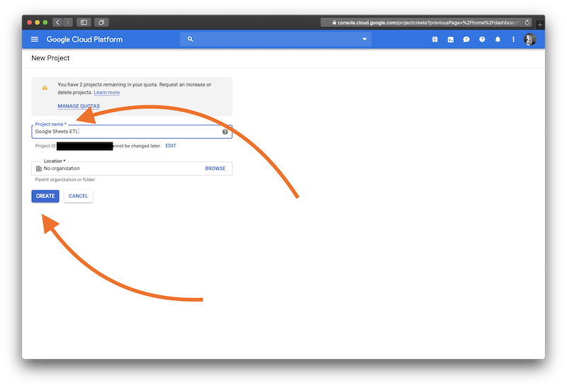

Then you have to open that project (it takes a moment to create).

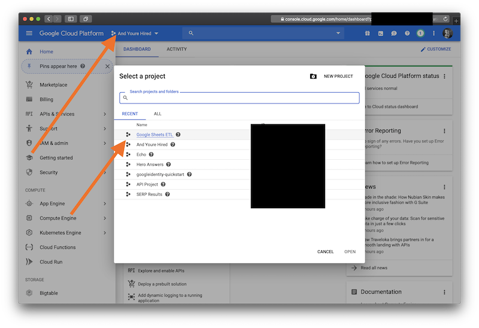

## Add the Google Drive API to the project

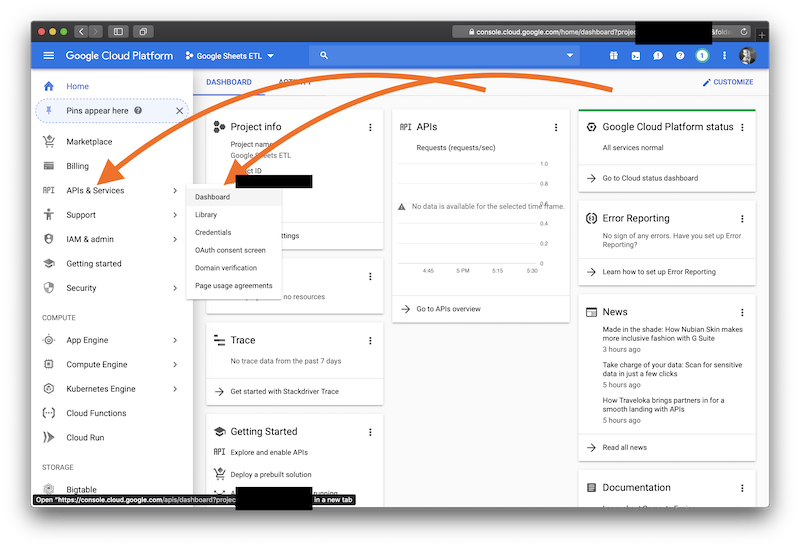

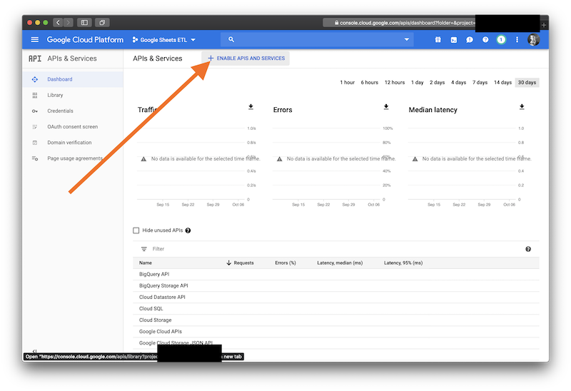

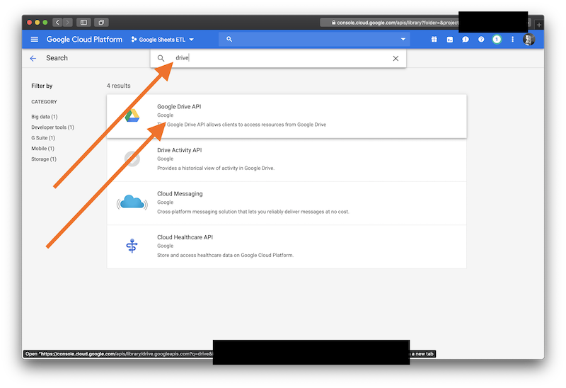

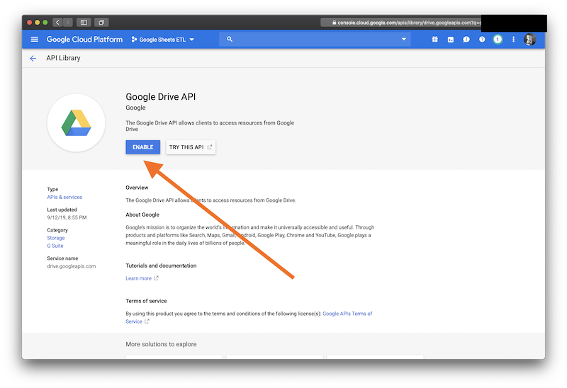

## Add the Google Sheets API to the project

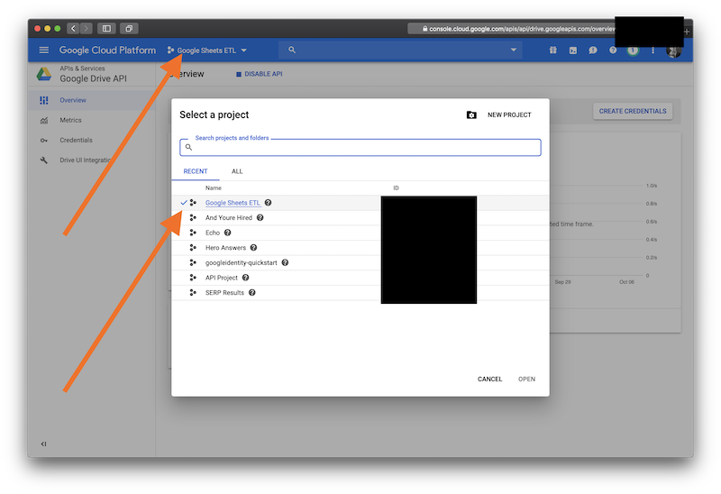

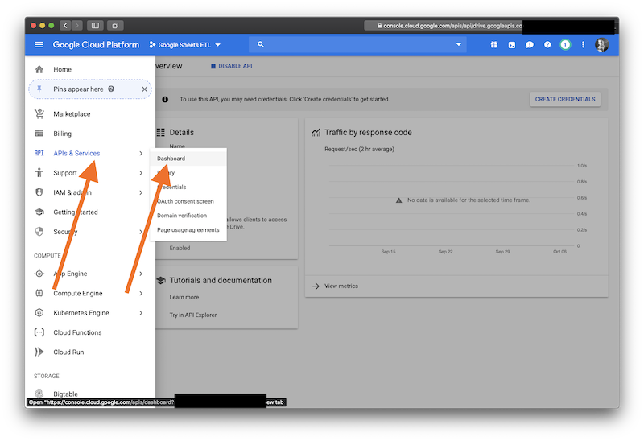

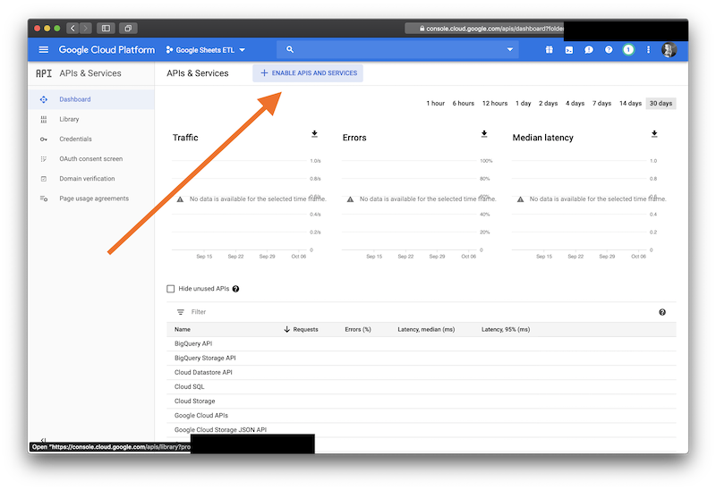

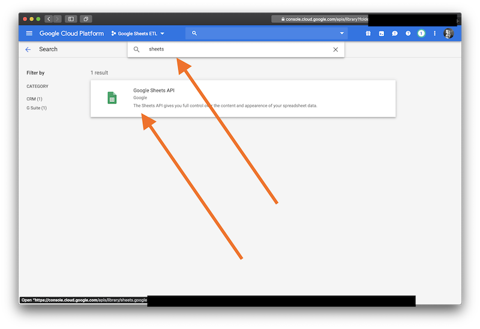

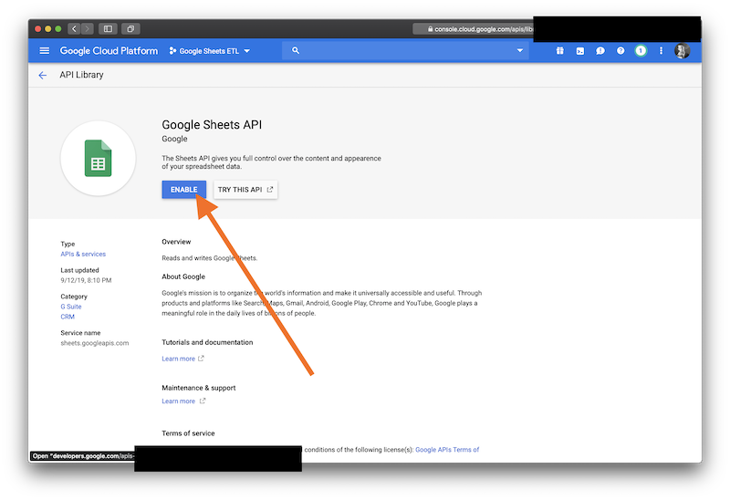

## Create a service account for the project

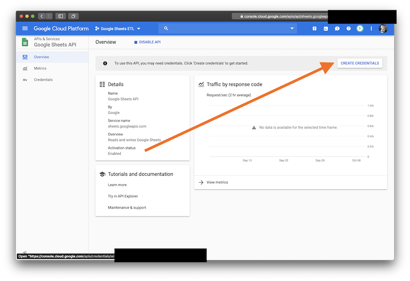

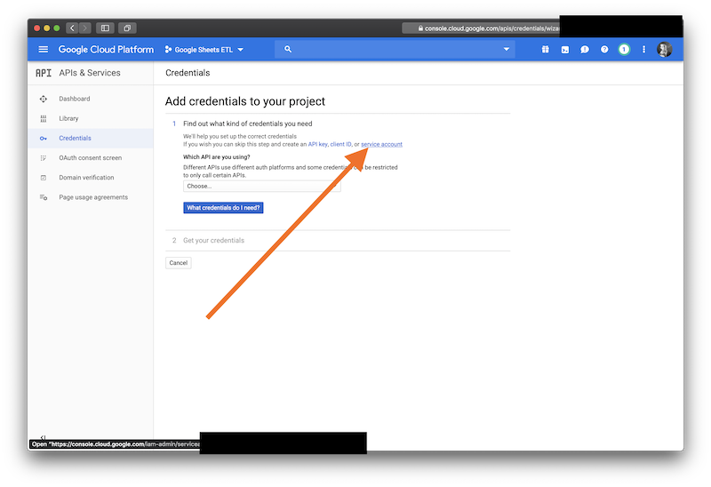

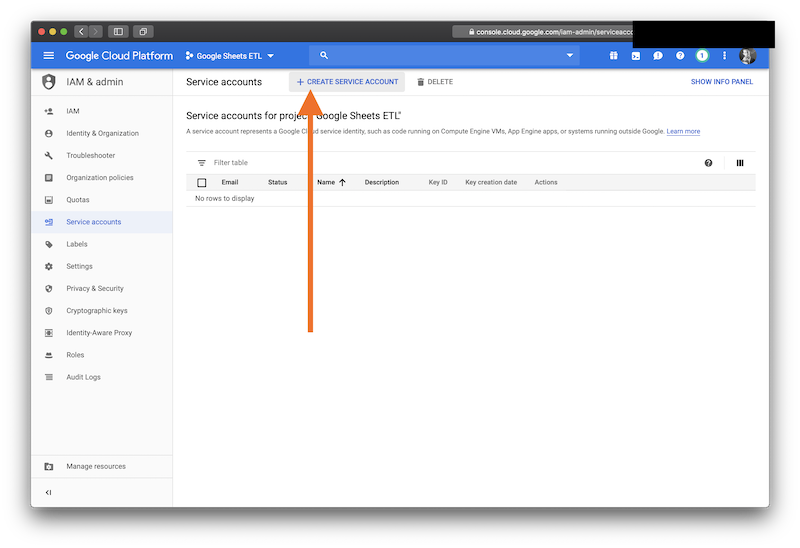

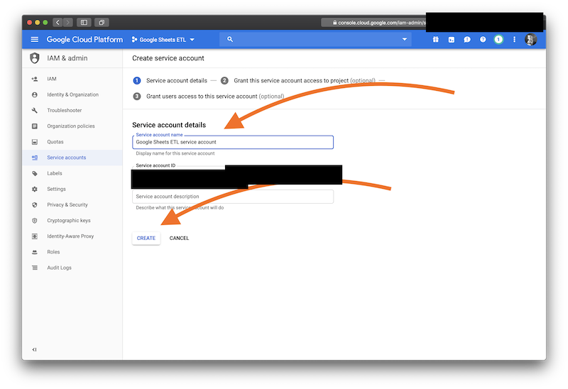

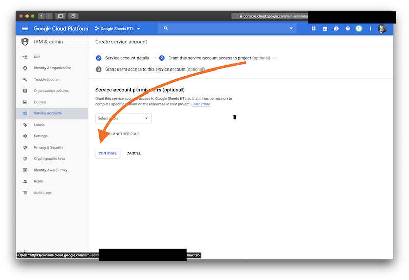

## Create an access key for this service account

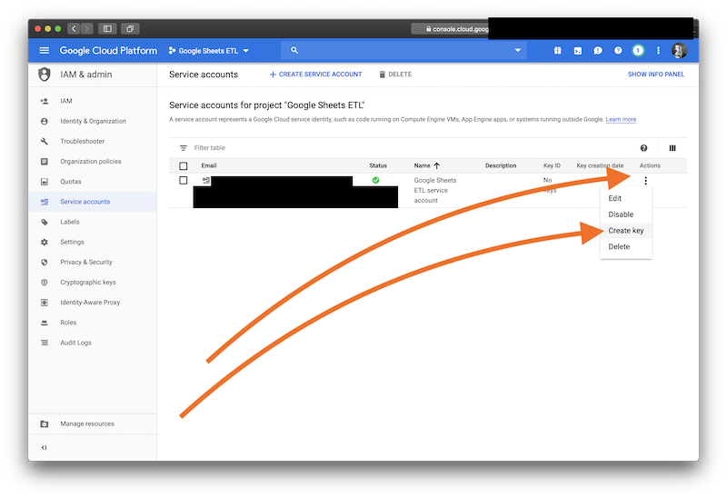

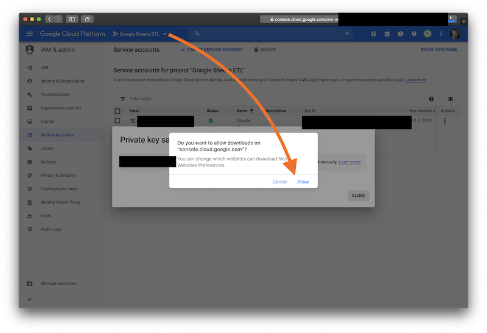

## Open the key

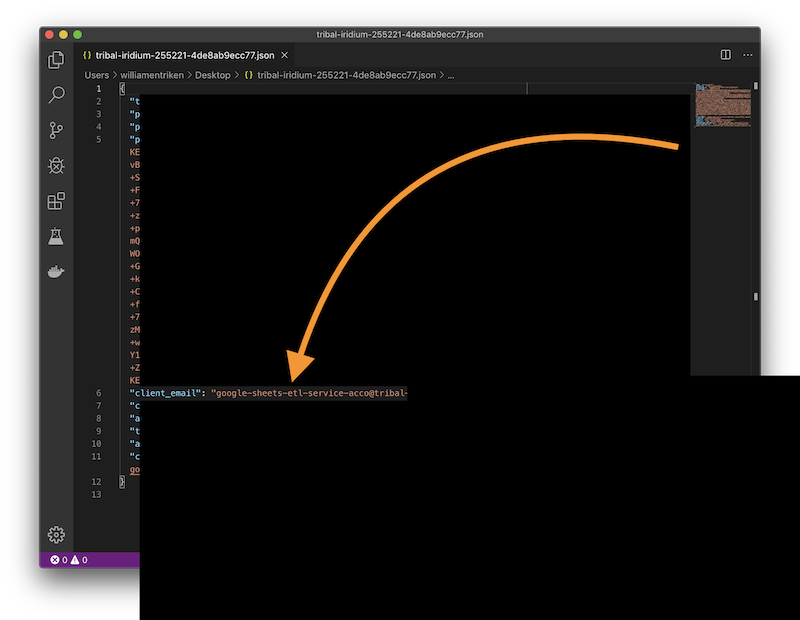

The client_email is the email address for your service account. You will share your Google Sheets with that account, or entire folders from Google Drive.