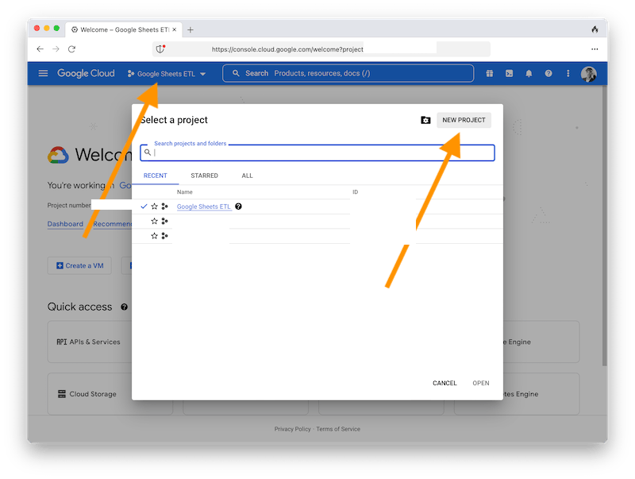
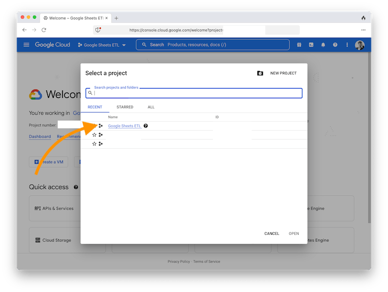

# Google service account setup

You will create a Google Service Account which you, your employees, or others will share files with. Google Sheets ETL will log into Google as this service account to access those files.

## Create a Google account

Use your Gmail account or corporate account.

## Create a Cloud Platform project

1. Start at https://console.cloud.google.com/ and create a project
   

2. Open that project (it takes a moment to load)
   

3. Add the Google Drive API to the project
   

   

   

   

   

4. Add the Google Sheets API to the project

   1. Click GOOGLE CLOUD logo on the top left
   2. Repeat the step above to OPEN the project
   3. Repeat the step above to ENABLE API
   4. Repeat the step above to ENABLE the Google Sheets API (instead of the Google Drive API)

5. Create a service account for the project

   

   

   

   

6. Create key

   

   

7. Open that downloaded file

   1. The `client_email` is the email address for your service account. You will share your Google Sheets with that account, or entire folders from Google Drive.
   2. Save that key file to your `local` folder in the project folder.